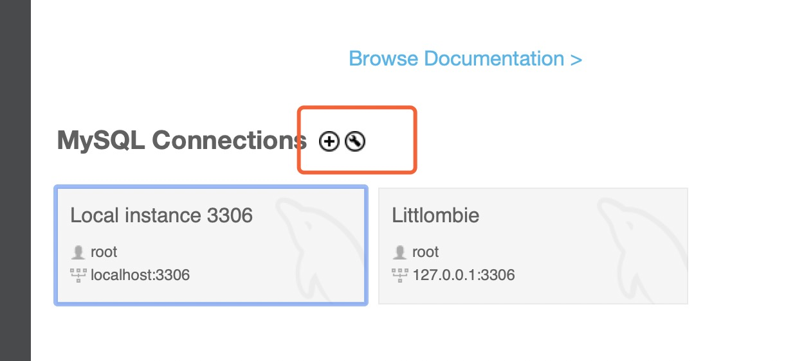
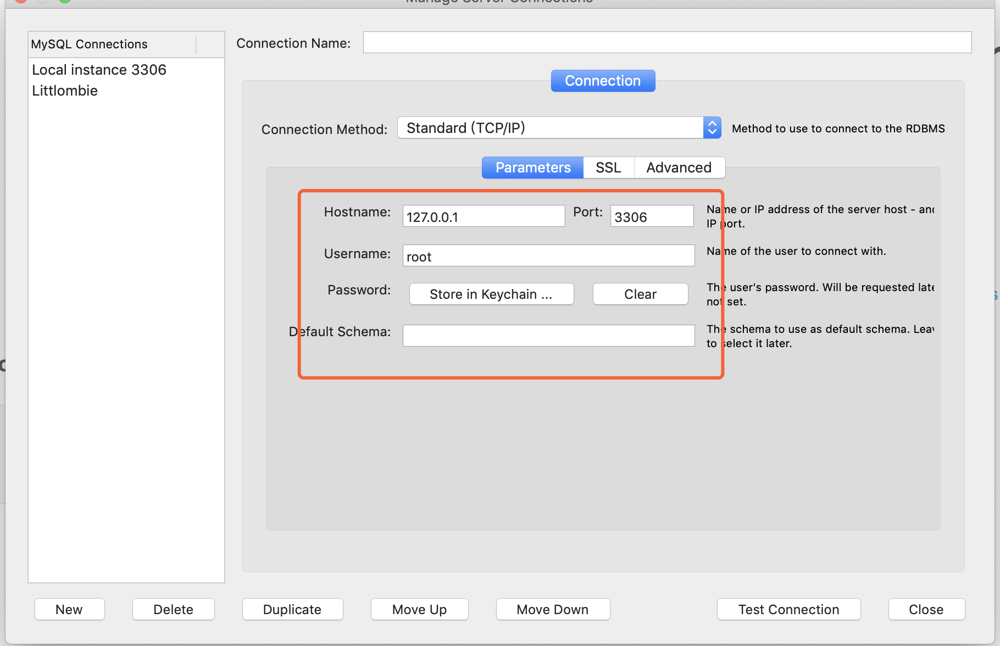
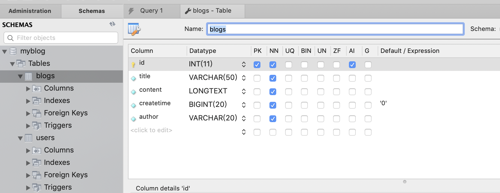
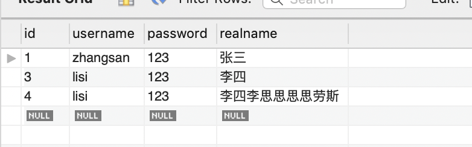
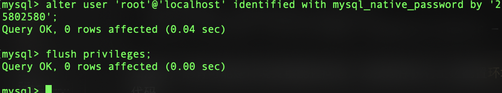
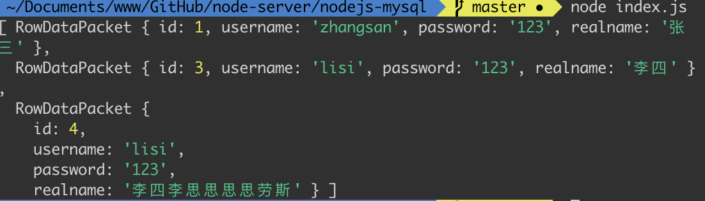

# nodejs连接配置mysql 数据库

## 安装mysql

安装mysql直接可以在其官网按照自己的需求个电脑的配置下载，[链接](https://dev.mysql.com/downloads/mysql/)；
安装可以直接默认安装配置用户名、端口、密码。

## 配置mysql
安装成功后需要添加环境变量，以macOs 10.14为例；
默认安装路径为`/usr/local/mysql`,

### 1.打开终端 定位到`/home/~/`

创建`.bash_profile`文件？（注意文件的名前边 . ）
执行：
```
touch .bash_profile 
```

### 2.创建环境变量
打开`.bash_profile`
```
open .bash_profile
```
在末尾添加
```terminal
export PATH=${PATH}:/usr/local/mysql/bin
mysql=/usr/local/mysql/bin/mysql
mysqladmin=/usr/local/mysql/bin/mysqladmin
```
保存文件关闭；

### 3.激活环境变量配置
```
source .bash_profile
```

## 下载mysql客户端

也是在官网下载MySQL workbench，[链接](https://dev.mysql.com/downloads/workbench/)

### 配置workbench
下载安装 根据自己需求配置账号密码端口



点击上边的+ 添加，或者点击设置修改配置



上边做host、prot配置；

### 创建数据库 表格
配置成功后创建数据库

如图，创建一个myblog的数据库，里边在创建两个表格`blogs`，`users`，
参数类型按照自己需求做配置，如图右边示例；

创建好后输入在`users`表里边添加数据，查询会出现如下表格



### mysql的基本语法
``` sql
use myblog;

-- show tables;

-- insert into users(username, `password`, realname) values('lisi', '123', '李四李思思思思劳斯');

-- select * from users;

-- select id,username from users;

-- select * from users where username='zhangsan';

-- select * from users where username='zhangsan' and `password`='123';

-- select * from users where username='zhangsan' or `password`='123';

-- select * from users where username like '%z%';

-- select * from users where password like '%1%' order by id desc;

-- update

-- update users set realname='李四' where username='lisi';

-- SET SQL_SAFE_UPDATES=0;

-- DELETE

-- delete from users where username='lisi';   --  不等于 <>

-- select * from users where state='1';

-- update users set state='1' where username='lisi' -- 软删除
```

以上是sql语句的基本语法。

## nodejs连接MySQL（*测试）

创建一个文件夹`nodejs-mysql`, 打卡初始化
```
npm init -y
```
### 安装`mysql`,

```
npm install mysql 
```

安装慢可以使用`淘宝镜像`或者`yarn add`，

### 连接

安装成功后创建文件 `index.js`

``` javascript
const mysql = require('mysql');

// 创建链接对象
const con = mysql.createConnection({
    host: 'localhost',
    user: 'root',
    password: '25802580',
    port: '3306',
    database: 'myblog'
});

// 开始连接
con.connect();

// 执行sql语句

const sql = 'select * from users;';
con.query(sql, (err, result) => {
    if (err) {
        console.log(err);
        return;
    }
    console.log(result);
});

con.end();
```

运行`node index.js`，就可以看见数据库的数据

*问题：
运行失败报错
```
Client does not support authentication protocol requested by server；
```
处理方法：

1. 打开终端输入
```
mysql -u root -p
```
输入密码，会显示如下信息：
```
Welcome to the MySQL monitor.  Commands end with ; or \g.
Your MySQL connection id is 19
Server version: 8.0.16 MySQL Community Server - GPL
```
如没有，则有可能是环境变量配置问题，则按顺序执行上边配置`环境变量`代码，

进入自己需要连接的数据库
```
use myblog
```

执行如下代码

```
alter user 'root'@'localhost' identified with mysql_native_password by '*******（mysql密码）' ;
```
```
flush privileges;
```
两次都显示`Query OK`,表示配置成功了，  
然后在执行
```
node index.js
```



