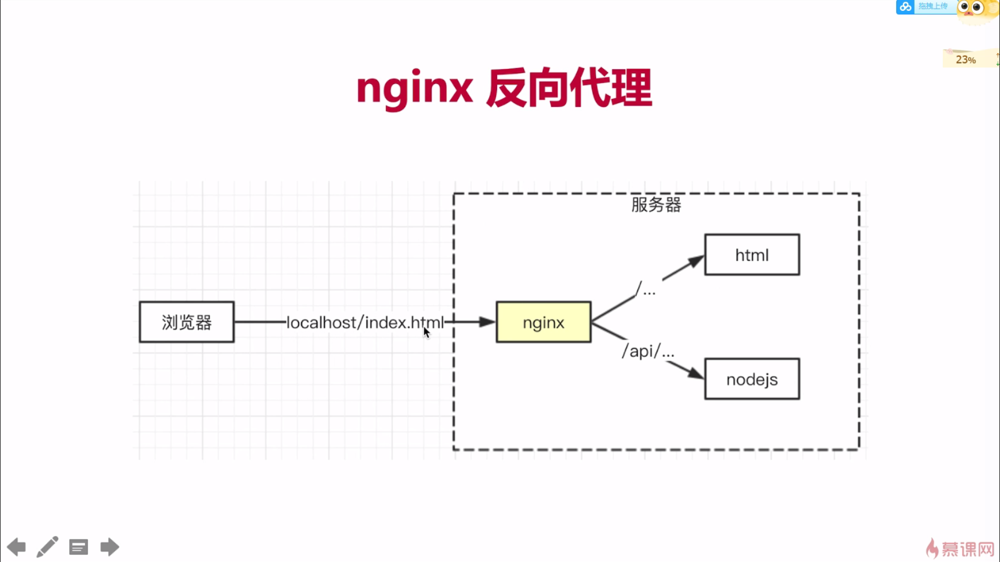

# Nignx

## 介绍

- 高性能的web服务器，开源免费
- 一般用于做静态服务、负载均衡
- [反向代理](https://www.cnblogs.com/limeng951/p/5770892.html)，客户端不可代理叫反向代理



## 安装
```
brew install nginx
```

## 配置路径
- windows:   
`C:\nginx\conf\nginx.conf`
- Mac:   
`/usr/local/ect/nginx/nginx.conf`，
打开方式是 `sudo vim /usr/local/ect/nginx/nginx.conf` 会以vim形式打开  

修改记录：
```
    #access_log  logs/access.log  main;

    sendfile        on;
    #tcp_nopush     on;

    #keepalive_timeout  0;
    keepalive_timeout  65;

    #gzip  on;

    server {
        listen       9090;
        server_name  localhost;

        #charset koi8-r;

        #access_log  logs/host.access.log  main;

     #  location / {
     #      root   html;
     #     index  index.html index.htm;
     #  }
     location / {
        proxy_pass http://localhost:8081;
     }
     location /api/ {
        proxy_pass http://localhost:8000;
        proxy_set_header Host $host;
     }

        #error_page  404              /404.html;

        # redirect server error pages to the static page /50x.html
        #
```
保存退出（:wq）

## nginx 命令
- 测试配置文件格式是否正确   
`nginx -t`

显示 `nginx: the configuration file /usr/local/etc/nginx/nginx.conf syntax is ok `  
` nginx: configuration file /usr/local/etc/nginx/nginx.conf test is successful`
表示ok，配置成功

- 启动   nginx  
`nginx`；   
重启  
`nginx -s reload`
- 停止   
`nginx -s stop`  